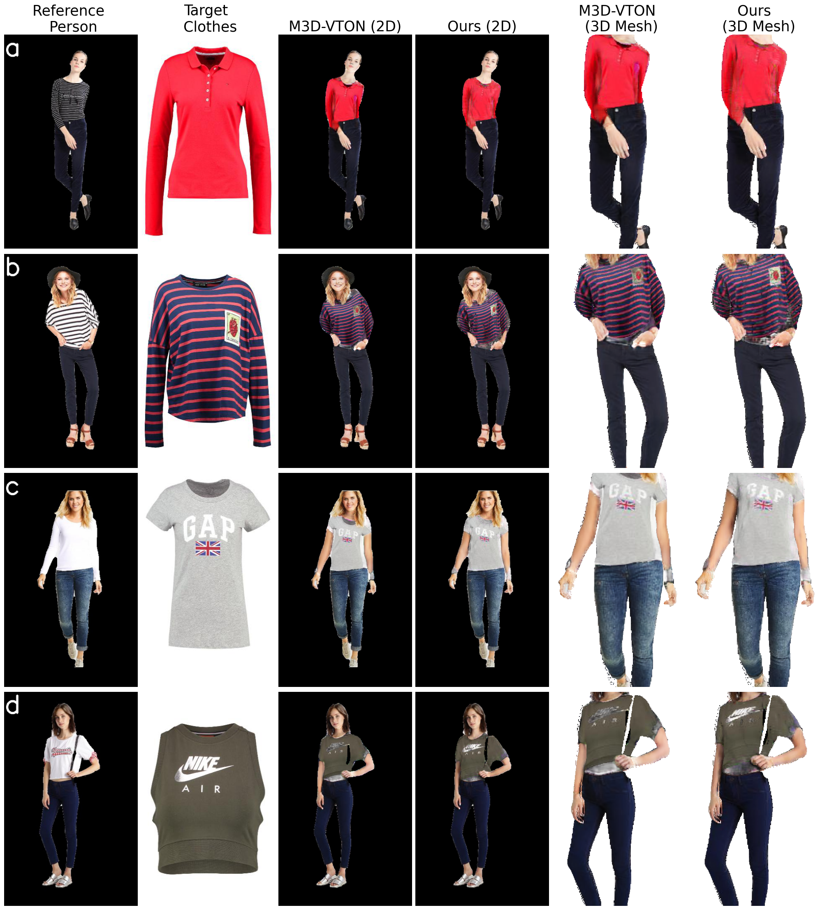

# Monocular-to-3D Virtual Try-On using Deep Residual U-Net

A course project for COMP 6381 Digital Geometric Modelling, Fall 2021.

[[Project Page](https://hasibzunair.github.io/resm3dvton/)]

<p align="center">
    <a href="#"></a> <br/>
    <em>
        Figure 1. Comparing the 2D try-on and 3D mesh output of the proposed method with previous work.
    </em>
</p>

This code is built on top of ICCV 2021 paper *M3D-VTON: A Monocular-to-3D Virtual Try-On Network* ([Paper](https://arxiv.org/abs/2108.05126), [Code](https://github.com/fyviezhao/M3D-VTON))

### Make environment

Python >= 3.8.0 required. Run below commands.

```sh
conda create --name comp6381 python=3.8
conda activate comp6381
conda install pytorch torchvision torchaudio cudatoolkit=11.1 -c pytorch-lts -c nvidia
conda install -c conda-forge jupyterlab
pip install opencv-python, matplotlib, sklearn, tqdm, pycocotools, tensorboard
```

OR run `conda env create -f <environment-name>.yml`.

### Preprocess data

After downlaoding dataset, keep it in a folder named `datasets` in the root directory and then run:

```python
python util/data_preprocessing.py --MPV3D_root datasets/MPV3D/
```

### Train MTM module
```python
python train.py --model MTM --name MTM --dataroot datasets/MPV3D/ --datalist train_pairs --checkpoints_dir logs/res-m3dvton
```
then run the command below to obtain the --warproot (here refers to the --results_dir) which is necessary for the other two modules:

```python
python test.py --model MTM --name MTM --dataroot  datasets/MPV3D/ --datalist train_pairs --checkpoints_dir logs/res-m3dvton/ --results_dir outs/mtm_outputs
```

### Train DRM
```python
python train.py --model DRM --name DRM --batch_size 4 --dataroot datasets/MPV3D/ --warproot outs/mtm_outputs/aligned/MTM/train_pairs --datalist train_pairs --checkpoints_dir logs/res-m3dvton
```

### Train Residual U-Net TFM
```python
python train.py --model TFM --name TFM --batch_size 2 --dataroot datasets/MPV3D/ --warproot outs/mtm_outputs/aligned/MTM/train_pairs --datalist train_pairs --checkpoints_dir logs/res-m3dvton

```
(See options/base_options.py and options/train_options.py for more training options.)


### Test model
Run `bash infer.sh`.

Now you should get the point cloud file prepared for remeshing under `results/aligned/pcd/test_pairs/*.ply`. [MeshLab](https://www.meshlab.net/) can be used to remesh the predicted point cloud, with two simple steps below:

- Normal Estimation: Open MeshLab and load the point cloud file, and then go to Filters --> Normals, Curvatures and Orientation --> Compute normals for point sets

- Possion Remeshing: Go to Filters --> Remeshing, Simplification and Reconstruction --> Surface Reconstruction: Screen Possion (set reconstruction depth = 9)

Now you will get the final 3D try-on result!


### Running on custom images


See `notebooks/custom.ipynb` for resizing, binary segmentation and pose estimation.

Prepare person image by following:

1) Get a full body person image (P) and remove background with [https://www.remove.bg/](https://www.remove.bg/).
2) Resize P to 320*512
3) Get pose from P
4) Get segmentation label from P

Prepare clothing image by following:

1) Get frontal clothing image (C) and resize to to 320*512
2) Get binary mask of C

Rename files following the MPV3D data format and then run `python util/data_preprocessing.py --MPV3D_root mpv3d_example_custom` to get
preprocessed data. Finally run `bash infer_custom.sh` and follow steps above to get 3D tryon outputs.

### References
* [M3D-VTON: A Monocular-to-3D Virtual Try-On Network](https://arxiv.org/abs/2108.05126)
* Metrics computed using [PyTorch FID](https://github.com/mseitzer/pytorch-fid) and [PyTorch SSIM](https://github.com/Po-Hsun-Su/pytorch-ssim) packages.